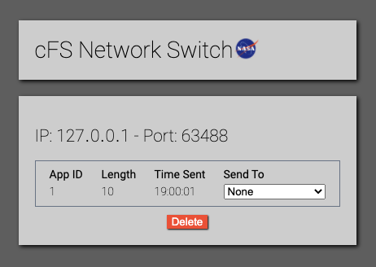

# cFS Network Switch Simulator

## Purpose

The purpose of the Network Switch Simulator is to create an easy method of interacting with datagrams to simulate the actions of a network switch. As a result, it stores a limited amount of state data for various applications, and allows users to send that data to given IPs at any point.

## Setup

## Implementation

The simulator is built on NodeJS, using Express as its web framework. It implements lowdb as a simple noSQL database built on JSON, which is fast and robust enough for our purposes.

The Interface is built using ReactJS and SocketIO for interactive testing. Updates are displayed on the client as soon as they're saved to the server.

## Use

The web interface is available on port 8080 of the machine that it's being run on. States should be sent to port 8081, and states and their associated data will be sent to port 8082 on the receiving machine. This is to allow the user to run the simulator on the same computer that they're running the receiving socket on.

## Interface

The interface for the simulator was intended to be as simple as possible while still providing reasonable debugging tools. As a result, it implements a simple card view, where each client application (IP address and port number combination) has its own card and tracks its own state. In each card, we keep track of the send app ID, the length of the datagram received, and the time that the datagram was sent (according to metadata included in the datagram along with the state). Each card also has a dropdown that users can use to send a state to a specific IP address. If the states in the card are no longer needed, the user can delete the states with a button at the bottom.

## Limitations

Because this is a testing tool, there are some simplifications that we made that are different from a real network switch:

### Table and .so Files

Because it would take significant effort to implement a database of app IDs, and it would likely lead to little testing benefit, the files must be loaded manually by the server administrator. These files are located in `public/files`. Since their names are hardcoded into the server, the following naming conventions must be used:

| File Type      | Required Name        |
| -------------- | -------------------- |
| Message Table  | `message_table.tbl`  |
| Schedule Table | `schedule_table.tbl` |
| App `.so` file | `cfs_app.so`         |

### IP Addresses

Because it would be difficult to manage a permanent list of all IP addresses ever received (since it would require extra delete buttons to remove them), the only IP addresses that are saved are IPs that are associated with a state that is currently saved in the simulator. When a state is received from a new IP address, that IP address is now available to send to. When all of the packets from a given IP address are deleted, it is no longer possible to send to that IP address.

### IP Address Storage

Because of the way that JSON and Javascript use periods (.), IP addresses get turned into nested dictionaries. This makes them really annoying to work with, so I replaced all periods in the database with the identical looking but totally different "one dot leader". This means that it looks just like a period, but will not be read by other programs as a period (so if you copy-paste from the database you're going to have a really bad time trying to figure out what's wrong). However, we switch them back before they're displayed on the interface, so you should be able to copy-paste them just fine from there.

## Output

### State

| Data                                         | Size                         |
| -------------------------------------------- | ---------------------------- |
| Packet ID (1)                                | 1 byte                       |
| Length of app name                           | 1 byte                       |
| App name (null-terminated char array)        | Variable                     |
| Length of app entry point                    | 1 byte                       |
| App entry point (null-terminated char array) | Variable                     |
| Stack size                                   | 4 bytes                      |
| Priority                                     | 2 bytes                      |
| State                                        | Variable (length calculated) |

### Table and so Files

| Data                | Size                         |
| ------------------- | ---------------------------- |
| Packet ID (2-4)[^1] | 1 byte                       |
| File                | Variable (length calculated) |

[^1]: schedule table id  = 2, application `.so` id = 3, message table id = 4

